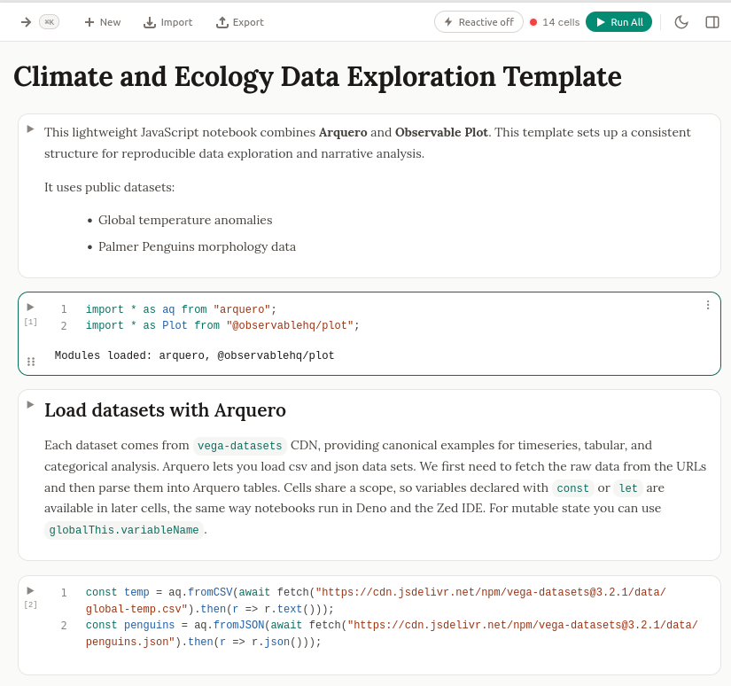

# tangent/note

A mostly vibe coded javascript notebook, featuring a modern sober interface, supporting data viz, local-first on the web, with a Zed/deno -style notebook format in pure JavaScript. The notebook app is on the web but once the browser runs it, data files stay in the local cache and computations are made on your processor.



## Start

Head to note.tangent.to, where an updated instance is running, or run it yourself. The toolchain works under either Node.js or Deno; pick one.

### Prerequisites

- Node.js 20+, **or** [Deno](https://deno.com) 2+

### Installation

```bash
# Clone the repository
git clone https://github.com/tangent-to/note.git
cd note

# Install dependencies
npm install          # Node
# or
deno task install    # Deno (--allow-scripts is set so native deps build)
```

### Running

```bash
npm run dev          # Node
# or
deno task dev        # Deno
# then head to http://localhost:5173
```

The Deno tasks (`dev`, `build`, `preview`, `check`, `test`, `serve`) mirror the npm scripts and run the same Vite/Svelte toolchain from `node_modules`; see `deno.json`. Both paths are tested: install, dev, build, type-check and the test suite all pass under Deno.

**Build for Production:**

```bash
npm run build
```

## Usage

### Open a notebook from a link

A notebook can be opened directly from a URL, which is handy for sharing:

- **From any URL:** `https://note.tangent.to/import?url=https://example.com/my-notebook.js` (a pasted `github.com/...blob...` URL is rewritten to its raw form automatically)
- **From GitHub:** `https://note.tangent.to/gh/<owner>/<repo>/<path-to-file>.js` (uses the repo's default branch; pin one with `/gh/<owner>/<repo>@<ref>/<path>`)

Both `.js` (tangent/note format, see [NOTEBOOK_FORMAT.md](NOTEBOOK_FORMAT.md)) and `.json` exports work. The host serving the file must allow cross-origin requests (GitHub raw content does). Nothing runs automatically: you still choose when to run cells.

### Work on a local file (`note serve`)

In the browser, saving a notebook is a download: a new file lands in your downloads folder, disconnected from the copy in your repository, so git has nothing to track. `note serve` fixes that by putting a small local process in charge of the file.

```bash
npm run build # once, to produce dist/
npm run serve -- path/to/notebook.js # then open http://localhost:4321
```

The companion serves the app from localhost and keeps the file and the open tab in sync in both directions:

- **Editor to browser**: The file is watched, so a change made in Zed, VS Code  or by a coding agent is pushed to the tab, which reloads the notebook.
- **Browser to disk**: `Ctrl/Cmd + S` writes that same file in place, so `git
  diff` shows an ordinary modification instead of an untracked download.

This is what makes an external editor and the notebook usable together: write and refactor with an agent in your editor, run and visualize in tangent/note, commit from the repository as usual. The header shows the linked file name while a companion is connected.

If the file changed on disk since the tab loaded, a save is refused once and warns you, so a background edit is not silently overwritten. Saving again overwrites deliberately.

Options: `--port` (default 4321) and `--dist` (default `dist`). The companion needs [Deno](https://deno.com). Without it, the app still runs from any static host and falls back to download-based saving.

Serving from localhost keeps the page same-origin with the companion, so this works the same in every browser, Firefox included. It deliberately does not use the File System Access API, which only Chromium implements.

### Keyboard Shortcuts

| Shortcut | Action |
|----------|--------|
| `Ctrl/Cmd + K` | Open Command Palette |
| `Ctrl/Cmd + /` | Toggle AI Chat |
| `Ctrl/Cmd + S` | Save Notebook |
| `Ctrl/Cmd + N` | New Notebook |
| `Ctrl/Cmd + O` | Open Notebook |
| `Ctrl/Cmd + Enter` | Run Current Cell |
| `Shift + Enter` | Run Cell and Select Next |
| `Alt + Enter` | Run Cell and Insert Below |
| `` Ctrl/Cmd + ` `` | Toggle Console |
| `Ctrl/Cmd + Shift + D` | Toggle Data Panel |

### The side panel

Everything that is not the notebook lives in one collapsible panel on the right, with a tab per tool: Info, Variables, Console, Chat and Data. One button in the header opens and closes it, each tool has its own shortcut, and the panel is resized by dragging its left edge (the width is remembered).

### Console

The Console tab (side panel, or `` Ctrl/Cmd + ` ``) is a REPL that evaluates JavaScript in the same scope as the notebook cells, the way RStudio's console shares its environment. Use it to inspect a value, run a quick test, or try an expression without adding a cell: type `nb` to list the notebook variables, read one with `nb.myVar`, or call `await data("file.csv")`. Anything you define (`const x = ...`) becomes available to the cells, and vice versa. Enter runs the line, `Shift + Enter` inserts a newline, and Arrow Up recalls history. It works in both kernel modes (background worker and main thread).

### AI Setup

The AI assistant is powered by **Ollama Cloud**. Open the AI sidebar (`Ctrl/Cmd + /`), click the settings icon, and paste your API key (from [ollama.com/settings/keys](https://ollama.com/settings/keys)). The current notebook is automatically sent to the model as context (as a system prompt), so you can ask it to explain, extend, or debug your cells. Default model: `qwen3-coder:480b-cloud` (any Ollama Cloud model works, e.g. `gpt-oss:120b-cloud`).

#### CORS and the browser

Ollama Cloud doesn't send CORS headers, so a browser can't call it directly. This project handles that with a small proxy, with no browser extension needed:

- **Running locally (`npm run dev`)**: works out of the box. The Vite dev   server proxies requests to `ollama.com`, so there's nothing to configure.
- **Deployed web build (e.g. note.tangent.to)**: deploy the bundled Cloudflare Worker proxy once and point the app at it. The worker forwards requests to `ollama.com` and adds CORS headers; each user still uses their own API key (it just passes through, the worker never stores it). See [`workers/ollama-proxy/README.md`](workers/ollama-proxy/README.md), then build with `VITE_OLLAMA_PROXY_URL` set to the worker URL. Without it configured, the app shows a notice and AI calls will be blocked by the browser.

### Examples

Head to note.tangent.to, an default example should load automatically.

## Tech stack

- **Frontend**. Svelte, TypeScript, Tailwind CSS
- **Build Tool**. Vite
- **Editor**. Monaco Editor
- **AI**. Ollama Cloud
- **Viz Libraries**. Observable Plot, Plotly, D3.js, Vega-Lite, Arquero

## File Format

Notebooks use a git-friendly text format (`.js` extension):

```javascript
// ---
// title: My Notebook
// id: notebook-12345
// ---

// %% [markdown]
/*
# Welcome to Tangent Notebooks
*/

// %% [javascript]
const data = [1, 2, 3, 4, 5];
console.log(data);
```

See [NOTEBOOK_FORMAT.md](NOTEBOOK_FORMAT.md) for details.

## License

MIT License - see [LICENSE](LICENSE) file for details.
