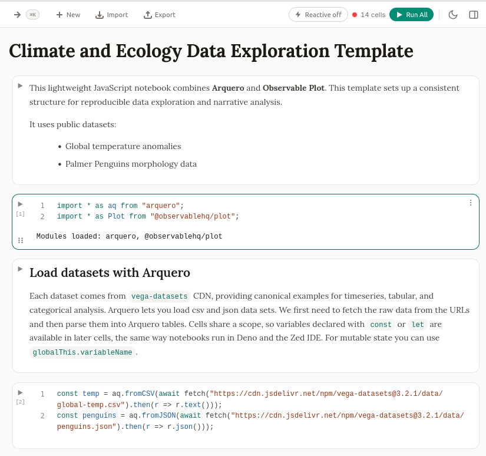

# tangent/note

A mostly vibe coded javascript notebook, featuring a modern sober interface, supporting data viz, local-first on the web, with a Zed/deno -style notebook format in pure JavaScript. The notebook app is on the web but once the browser runs it, data files stay in the local cache and computations are made on your processor.



## Start

Head to note.tangent.to, where an updated instance is running, or run it yourself. The toolchain works under either Node.js or Deno; pick one.

### Prerequisites

- Node.js 20+, **or** [Deno](https://deno.com) 2+

### Installation

```bash
# Clone the repository
git clone https://github.com/tangent-to/note.git
cd note

# Install dependencies
npm install          # Node
# or
deno task install    # Deno (--allow-scripts is set so native deps build)
```

### Running

```bash
npm run dev          # Node
# or
deno task dev        # Deno
# then head to http://localhost:5173
```

The Deno tasks (`dev`, `build`, `preview`, `check`, `test`, `serve`) mirror the npm scripts and run the same Vite/Svelte toolchain from `node_modules`; see `deno.json`. Both paths are tested: install, dev, build, type-check and the test suite all pass under Deno.

**Build for Production:**

```bash
npm run build
```

## Usage

### Open a notebook from a link

A notebook can be opened directly from a URL, which is handy for sharing:

- **From any URL:** `https://note.tangent.to/import?url=https://example.com/my-notebook.js` (a pasted `github.com/...blob...` URL is rewritten to its raw form automatically)
- **From GitHub:** `https://note.tangent.to/gh/<owner>/<repo>/<path-to-file>.js` (uses the repo's default branch; pin one with `/gh/<owner>/<repo>@<ref>/<path>`)

Both `.js` (tangent/note format, see [NOTEBOOK_FORMAT.md](NOTEBOOK_FORMAT.md)) and `.json` exports work. The host serving the file must allow cross-origin requests (GitHub raw content does). Nothing runs automatically: you still choose when to run cells.

### Work without a network

Cells load their libraries from a CDN as they run, so a notebook that works today would not open on a train. A service worker keeps what has been fetched — the app's own files, the libraries, the soundfonts — and serves them when there is no network: the app opens, and a notebook runs as far as what it has already loaded once.

#### Pinning imports

The best place for a version is the import itself: `import * as d3 from "https://cdn.jsdelivr.net/npm/d3@7.9.0/+esm"` travels with the notebook, reads plainly in a diff, and needs nothing from this app to be reproducible somewhere else. jsDelivr's `+esm` bundles pin their own dependencies exactly, so pinning the top level pins the whole tree.

**Pin Imports to Their Versions** (command palette) rewrites a notebook's unpinned imports to what they load right now: a bare `"d3"` becomes the versioned URL, an unversioned CDN URL gains its version, and a GitHub branch becomes the commit it points at — `@main` pinned to `@main` would pin nothing. Imports that already name a version are left alone, and so is anything whose host does not say what it resolved to.

#### Freezing a folder

Pinned imports cover most of this on their own. Freezing covers the rest — an import whose host says nothing, a soundfont fetched by note, anything loaded by a library that builds its own URLs — and records it in one place.

**Freeze** (Storage panel) writes `tangent.lock` in the notebook's folder: every URL its notebooks have actually loaded, with the hash of what came back. Frozen, the cache answers everything; a URL in the lock but missing from this browser is fetched once and checked against its hash, so a frozen folder cloned from git is the same environment; a URL in neither is refused, and says so in the cell rather than failing as an unexplained network error. **Unfreeze** goes back to following the network and keeps the lock as the record.

Only what has run can be pinned — a soundfont is fetched when a note using it plays — so the gesture is Run All, then Freeze. The lock is a file in the folder, so the environment belongs to the work and travels with it in git; one folder is active at a time, the one of the notebook on screen.

The Storage panel says how much is kept and offers to clear it; the app's own files are never cleared, so it still opens afterwards. The companion's socket and files are never cached, being live state. The cache only runs in a built app (`npm run serve`, or a deployed site), not under the Vite dev server, where it would serve the previous build.

### Back up what lives in the browser

Without the companion, notebooks and datasets are kept in the browser's own storage, which the browser may clear when space runs low and "clear site data" clears on purpose. The **Storage** panel says when the last backup was made, and asks for one — with a dot on its tab — when work that exists only in this browser has changed: a day after new work first appears, then at most weekly.

**Back up…** downloads `tangent-backup-YYYY-MM-DD.zip`. Tick *include the libraries* and it also carries everything cells loaded from the network, so the archive restores an environment that runs with no network at all — on another machine, in another browser. Unzipped, it is an ordinary folder: one `.js` per notebook — a notebook that wrote files gets a folder of its own, with them beside it — and a `data/` directory, which `note serve` can open as it is — so a backup is also how work moves from the browser to a local folder. `.tangent/backup.json` inside it keeps what the `.js` files cannot: outputs, where each notebook came from, and its dates.

**Restore…** brings an archive back. It never replaces anything newer in this browser with an older copy, and reports what it restored, what it kept and what it skipped. An archive without the index (a folder zipped by hand) still restores, from its files.

No compression library is involved: the archive is written with the browser's own `CompressionStream`, and it opens in any unzip tool.

### Work on a local file (`note serve`)

In the browser, saving a notebook is a download: a new file lands in your downloads folder, disconnected from the copy in your repository, so git has nothing to track. `note serve` fixes that by putting a small local process in charge of the file.

```bash
npm run build # once, to produce dist/
npm run serve -- path/to/notebooks/  # a directory, or a single notebook file
                                     # then open http://localhost:4321

npm run serve -- ~/notebooks --port 4400   # options come after the path
```

Give it a **directory** and it offers every notebook under it, listed in the Storage panel under "On disk"; open any of them in a tab and each is linked to its own file. Give it a **single file** and it opens that one, exactly as before.

The Storage panel keeps **one list**. A notebook is one thing, and where it lives is something it has, so each row says where — a path under the served directory, or "in this browser" — rather than falling into one section or another. A file the companion serves that you have never opened is a row too, marked "not opened yet".

Discovery is deliberately narrow: three levels deep at most, skipping `node_modules`, `dist`, `.git` and other hidden directories, and only files whose head carries a notebook's signature — the `// ---` frontmatter fence for a `.js` notebook, the `<notebook>` root element for an [Observable Notebooks 2.0](NOTEBOOK_FORMAT.md#observable-notebooks-20) `.html` one. A repository is full of `.js` that is not a notebook, and holds far more HTML still; offering all of it would bury the two files you actually work in.

Saving writes back the format the file is in, so an Observable notebook stays an Observable notebook. What a conversion cannot carry — Observable is reactive by construction, Tangent is not — is listed rather than dropped in silence; see [NOTEBOOK_FORMAT.md](NOTEBOOK_FORMAT.md#observable-notebooks-20).

The companion serves the app from localhost and keeps those files and the open tabs in sync in both directions:

- **Editor to browser**: files are watched, so a change made in Zed, VS Code or by a coding agent is pushed to the tab holding that file — wherever you happen to be looking.
- **Browser to disk**: `Ctrl/Cmd + S` writes that notebook's own file in place, so `git diff` shows an ordinary modification instead of an untracked download. A tab opened from a link or from the library has no file to write to, and the status bar says so; there `Ctrl/Cmd + S` still exports a download.

Every message is keyed by a path relative to the served root, and the companion resolves it through a single guard: anything that would leave that root — an absolute path, a `..` that climbs out — is refused rather than resolved. The browser names files for a local process here, and any page can be pointed at localhost.

This is what makes an external editor and the notebook usable together: write and refactor with an agent in your editor, run and visualize in tangent/note, commit from the repository as usual. The status bar names the linked file.

If the file changed on disk since the tab loaded, a save is refused once and warns you, so a background edit is not silently overwritten. Saving again overwrites deliberately.

**Save As** (`Ctrl/Cmd + Shift + S`) writes the notebook to a new file in the served directory and moves the tab onto it; the file it came from is left untouched. The extension picks the format — `.js` for Tangent's, `.html` for Observable's — so this is also how an Observable notebook becomes a Tangent one. The tab keeps its kernel, so nothing needs re-running. An existing file is never replaced without a second, explicit confirmation. Without the companion there is nowhere to write, and Save As falls back to the Export dialog.

#### The working directory

A notebook served this way has a working directory: the folder its file is in, as in Jupyter. Cells read files from it and write files to it:

```javascript
const rows = await FileAttachment("penguins.csv").csv({ typed: true });
await save("out/summary.json", { n: rows.length });
await save("figures/chart.svg", Plot.plot({ marks: [Plot.dot(rows, { x: "mass" })] }));
```

`FileAttachment` follows Observable's API (`.text()`, `.json()`, `.csv()`, `.tsv()`, `.arrayBuffer()`, `.blob()`, `.url()`, `.image()`), so data loading moves between the two unchanged. `save` writes what the file name asks for: text, JSON, records as CSV or TSV, a chart or any element containing an `<svg>` as a standalone SVG, a canvas as an image, and Blobs or typed arrays as they are. Names are relative to the notebook, a leading `/` starts at the served root, and missing folders are created. Nothing outside the served directory can be read or written, and `save` refuses to overwrite a notebook file.

Without the companion the notebook still has a folder: its own, in the browser's private file system. The same calls work — `save` writes a file the notebook can read back, not a download it cannot — and the Storage panel lists those files with a way to download or delete each one. Reads also fall back to datasets dropped into that panel. It is storage rather than a place in your file manager, and the browser may clear it, which is what the backup is for.

Only the app itself can use the companion's socket and file endpoints. Every web page open in your browser can send requests to localhost, and a WebSocket ignores the same-origin policy, so the companion checks the Host, Origin and Sec-Fetch-Site of each request and refuses anything that is not the app on its own port.

Options: `--port` (default 4321) and `--dist` (default `dist`). The companion needs [Deno](https://deno.com). Without it, the app still runs from any static host and falls back to download-based saving.

Serving from localhost keeps the page same-origin with the companion, so this works the same in every browser, Firefox included. It deliberately does not use the File System Access API, which only Chromium implements.

### As a desktop application

The desktop app is the same app: a window wrapped around the companion. It starts `note serve` for a folder on your machine and opens a window on `http://localhost:<port>`, so the origin is the one a browser would have — the sync socket, the working directory, the offline cache and a local Ollama all behave exactly as they do in a tab, and there is no desktop-only path to keep working.

```bash
npm run desktop          # run it, rebuilding the app and the companion first
npm run desktop:build    # a .deb and an AppImage in src-tauri/target/release/bundle
```

It needs [Rust](https://rustup.rs) and [Deno](https://deno.com) to build, and on Linux the WebKitGTK development packages Tauri asks for; what it produces needs neither.

On first run it opens `~/tangent-notebooks`, creating it if it is not there. **File → Open folder…** (`Ctrl/Cmd + Shift + O`) opens another one; the choice is remembered in `folder.txt` beside the app's configuration, and the app restarts into it — a companion owns one root, and the tabs, caches and socket are all keyed to that root.

That item is in the app's own File menu, not a native menu bar: a menu bar holding one item costs a strip of the window above a header that already has a File menu. It is there only in the desktop app, which the page can tell because Tauri injects its bridge into the window it opens — and because the page is served over http rather than Tauri's own protocol, the one command it may call is named explicitly in `src-tauri/permissions/`.

The companion travels inside the bundle as a sidecar binary (`deno compile --include dist`, so the built app is inside it too). That binary carries the Deno runtime and weighs about 100 MB, which is most of the bundle; the window itself is the system's own webview, and the Rust side is under 10 MB.

Because the built app is *inside* that binary, a change to the page is invisible until the sidecar is compiled again. While working on the app, set `TANGENT_NOTE_DIST` to the repository's `dist` and the companion serves it from disk instead — then `npm run build` is the whole loop:

```bash
TANGENT_NOTE_DIST=$PWD/dist ./src-tauri/target/release/tangent-note
```

The icons are generated from `src-tauri/app-icon.png` (rendered from `src/assets/images/logo.svg`) with `npx tauri icon src-tauri/app-icon.png`.

### Keyboard Shortcuts

| Shortcut | Action |
|----------|--------|
| `Ctrl/Cmd + K` | Open Command Palette |
| `Ctrl/Cmd + /` | Toggle AI Chat |
| `Ctrl/Cmd + S` | Save Notebook |
| `Ctrl/Cmd + N` | New Notebook |
| `Ctrl/Cmd + O` | Open Notebook |
| `Ctrl/Cmd + Enter` | Run Current Cell |
| `Shift + Enter` | Run Cell and Select Next |
| `Alt + Enter` | Run Cell and Insert Below |
| `` Ctrl/Cmd + ` `` | Toggle Console |
| `Ctrl/Cmd + Shift + D` | Toggle Storage Panel |

### The header and the status bar

The header is for doing, the status bar for knowing. On the left of the header: the command palette, the File menu, the open tabs. On the right: **Run All**, which is the one action frequent enough to be a button, with a chevron holding the rest — run the stale cells, reactive mode, restart the kernel, restart and run all. While cells are running, Run All becomes **Stop** in the same place. All of it is in `Ctrl/Cmd + K` too, so nothing lives only there.

Under the notebook, a quiet strip says what is true: the file this notebook writes to (or "not on disk", or "in this browser"), whether it has unsaved changes, how many cells it has, how many are waiting to be re-run, whether the kernel is running, and where cells run — worker or main thread, the first thing to check when an audio player renders but stays silent. Reactive mode and the kernel are also switches there: click the mode to flip it, click the kernel to open the Info panel where it is chosen.

### The side panel

Everything that is not the notebook lives in one collapsible panel on the right, with a tab per tool: Info, Variables, Console │ Chat, Storage. The rule marks where the panel stops following the notebook on screen — Variables and Console read that notebook's own kernel, while Chat is one conversation for the whole app and Storage is about the browser. One button in the header opens and closes it, each tool has its own shortcut, and the panel is resized by dragging its left edge (the width is remembered).

### The notebook library

Every notebook you open or create is kept in this browser, in IndexedDB. Opening another one never loses it, and there is nothing to confirm before you navigate: what is on screen is already stored.

That splits "saved" into two things that used to be one:

- **Saved to the library** happens on its own, a couple of seconds after you stop typing. It is not something you do.
- **Saved to its origin** — the file a `note serve` companion owns, or an exported `.js` — is what `Ctrl/Cmd + S` does, and what "unsaved" in the status bar means.

Several notebooks can be open at once. They appear as tabs in the header row — the strip is hidden while only one is open, and on narrow screens, where `Ctrl/Cmd + K` switches notebooks instead — and each tab shows what its notebook is doing even when you are not looking at it: a dot while it differs from its file, a spinner while its own cells are running. Closing a tab does not delete anything; the notebook stays in the library. The set of open tabs is restored when you come back.

Each notebook has its **own kernel**, and so its own variables. Opening a second notebook cannot inherit the first one's scope, stopping a runaway cell in one leaves the others untouched, and a run keeps writing into the notebook it started in even if you switch tabs while it works. Kernels start on first use, so a restored tab you never open costs nothing.

Open another notebook with `Ctrl/Cmd + K` and type its name: the library is listed in the command palette alongside the commands. The Storage tab is for housekeeping instead — what is stored, how big it is, and deleting what you no longer want. It lists notebooks and cached datasets side by side, since both are just bytes this browser is holding for you, plus a way to clear the chat history, the AI key and the preferences kept in `localStorage`.

Notebook ids travel in the `.js` file's frontmatter, so re-importing a file you already have reopens its entry rather than making a second copy. A notebook opened from a link gets an entry of its own, keyed by the link, so clicking a `/gh/…` URL can never overwrite the copy you have been editing — and clicking the same link twice lands back on the same entry rather than piling up duplicates.

In a private window, or when another tab holds an older version of the database, IndexedDB is unavailable. The library then keeps notebooks in memory for the session, and mirrors the one you are working in to `localStorage` so a reload still finds it — the same single slot, and the same last-write-wins limits, as before the library existed. The Storage tab says so, and the browser's "leave this page?" prompt comes back, because a second notebook really would be lost there.

### Console

The Console tab (side panel, or `` Ctrl/Cmd + ` ``) is a REPL that evaluates JavaScript in the same scope as the notebook cells, the way RStudio's console shares its environment. It belongs to that notebook: each tab keeps its own transcript and its own recall history, and they are cleared when the tab is closed. Use it to inspect a value, run a quick test, or try an expression without adding a cell: type `nb` to list the notebook variables, read one with `nb.myVar`, or call `await data("file.csv")`. Anything you define (`const x = ...`) becomes available to the cells, and vice versa. Enter runs the line, `Shift + Enter` inserts a newline, and Arrow Up recalls history. It works in both kernel modes (background worker and main thread).

### AI Setup

The AI assistant is powered by **Ollama Cloud**. Open the AI sidebar (`Ctrl/Cmd + /`), click the settings icon, and paste your API key (from [ollama.com/settings/keys](https://ollama.com/settings/keys)). The current notebook is automatically sent to the model as context (as a system prompt), so you can ask it to explain, extend, or debug your cells. Default model: `qwen3-coder:480b-cloud` (any Ollama Cloud model works, e.g. `gpt-oss:120b-cloud`).

#### CORS and the browser

Ollama Cloud doesn't send CORS headers, so a browser can't call it directly. This project handles that with a small proxy, with no browser extension needed:

- **Running locally (`npm run dev`)**: works out of the box. The Vite dev   server proxies requests to `ollama.com`, so there's nothing to configure.
- **Deployed web build (e.g. note.tangent.to)**: deploy the bundled Cloudflare Worker proxy once and point the app at it. The worker forwards requests to `ollama.com` and adds CORS headers; each user still uses their own API key (it just passes through, the worker never stores it). See [`workers/ollama-proxy/README.md`](workers/ollama-proxy/README.md), then build with `VITE_OLLAMA_PROXY_URL` set to the worker URL. Without it configured, the app shows a notice and AI calls will be blocked by the browser.

### Examples

Head to note.tangent.to, an default example should load automatically.

## Tech stack

- **Frontend**. Svelte, TypeScript, Tailwind CSS
- **Build Tool**. Vite
- **Editor**. Monaco Editor
- **AI**. Ollama Cloud
- **Viz Libraries**. Observable Plot, Plotly, D3.js, Vega-Lite, Arquero

## File Format

Notebooks use a git-friendly text format (`.js` extension):

```javascript
// ---
// title: My Notebook
// id: notebook-12345
// ---

// %% [markdown]
/*
# Welcome to Tangent Notebooks
*/

// %% [javascript]
const data = [1, 2, 3, 4, 5];
console.log(data);
```

See [NOTEBOOK_FORMAT.md](NOTEBOOK_FORMAT.md) for details.

## License

MIT License - see [LICENSE](LICENSE) file for details.
